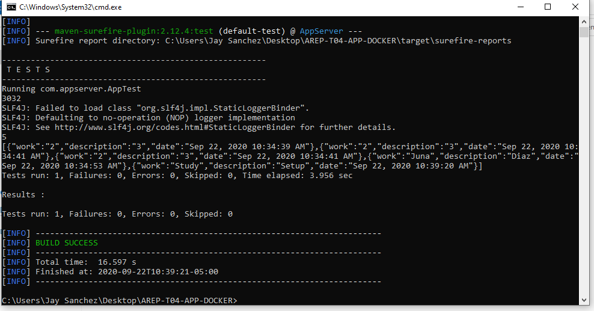

# AREP-T04-APP-DOCKER
### Presentado por:

Jeisson G. Sanchez R.

### Docker repository

[ver](https://hub.docker.com/r/jsanchez0/app-server-note)

### Build

~~~
    docker build --tag jaysanchez0/app-server-note .
~~~

### Docker pull

~~~
    docker pull jsanchez0/app-server-note
~~~

### Run in docker
~~~
    docker run -dp 90:90 -e PORT=90 jsanchez0/app-server-note
~~~

Cambia el puerto como variable de entorno al 90 y transfiere el trafico del puerto 90 del contenedor al 90 de la maquina virtual.

### Aplicacion

### Contenedores

Como podemos ver con docker ps, tenemos una imagen de mongodb, 3 instancias de la aplicacion y una del balanceador de carga

### Pruebas

### Nota la maquina virtual se apagara asi que las pruebas y la aplicacion dejaran de funcionar

Para probrala en el balanceador de carga puede cambiar la url de los nodos hijos en la Clase App, el metodo get Url.

De igual manera en el los nodos hijos cambiar la url de coneccion a la base de datos en la clase de data.

Para iniciar la imagen de mongo

Solo requiere realizar las 2 modificaciones mencionadas anteriormente para que las 2 aplicaciones funcionen correctamente

Por favor regenerar las imagenes con las modificaciones para motivos de prueba de la funcionalidad.

~~~

    docker run mongo -dp 27017:27017

~~~

## La aplicacion no se va a encontrar disponible en su url, ya que la maquina virtual se encuentra apagada